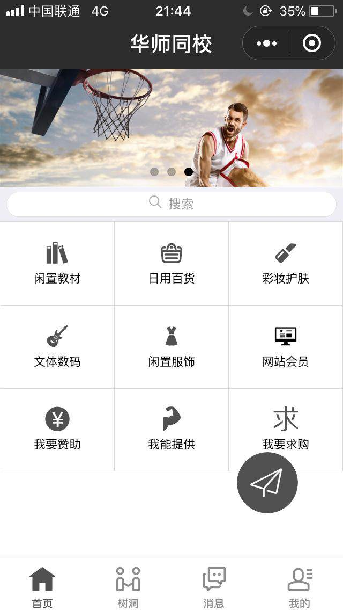

# 2018_3_7学习总结日志

最近算是入门了微信小程序的小程序端吧，因为大一学习过html+css，然后再补一些js知识就去捣鼓了，我觉得这是学习的比较快的方法吧，实践出真知哈哈。贴个目前的效果图先，然后说一下我的做法



- **多参考官方文档**
- **到github等地方下载一些demo项目看别人的源码**
- **看清wxml的结构，然后wxss一部分一部分的删除，看对应影响的位置，再修改**
- **js的逻辑注意看wxml中的bindtap**
- **util.js放一些需要复用的代码，然后需要模块导出才行**
- **app.wxss放一些全局样式**

-------------------

## 微信小程序顶部轮播图

```
<!--index.html-->
<swiper indicator-dots="{{indicatorDots}}"
  autoplay="{{autoplay}}" interval="{{interval}}" duration="{{duration}}"
  style="height:110px">
  <block wx:for="{{imgs}}">
    <swiper-item>
      <image src="{{item}}" class="slide-image"/>
    </swiper-item>
  </block>
</swiper>
```
> 这个组件的详细介绍官方文档介绍的很清楚，我就不赘述了，链接在这 [官方文档](https://mp.weixin.qq.com/debug/wxadoc/dev/component/swiper.html)
值得一提的是swiper的wxss是在底层框架就写好了的，所以可以不写wxss，但我尝试改变高度也不行，网上搜索后知道了可以加上 `style="height:110px"`的样式来控制高度。
```
<!--index.js-->
Page({
  data: {
    imgs: [
   'http://img1.ph.126.net/cklMeYA02CjMLCfn7Vde0Q==/1600466717677148080.jpg',
      'http://img06.tooopen.com/images/20160818/tooopen_sy_175866434296.jpg',
      'http://img06.tooopen.com/images/20160818/tooopen_sy_175833047715.jpg'
    ],
    indicatorDots: true,
    autoplay: true,
    interval: 3000,
    duration: 600
  }
})
```
> 将轮播图要展示的图片以url的形式放在data中的一个数组里面，indicatorDots是指示点，autoplay是否自动播放，interval自动播放的时间间隔，duration滚动动画的时间


## 微信小程序搜索栏

```
<!--index.wxml-->

<view class="weui-search-bar">
    <view class="weui-search-bar__form">
        <view class="weui-search-bar__box">
            <icon class="weui-icon-search_in-box" type="search" size="14"></icon>
            <input type="text" class="weui-search-bar__input" placeholder="搜索" value="{{inputVal}}" focus="{{inputShowed}}" bindinput="inputTyping" bindblur="hideInput" />
            <view class="weui-icon-clear" wx:if="{{inputVal.length > 0}}" bindtap="clearInput">
                <icon type="clear" size="14"></icon>
            </view>
        </view>
        <!--未输入时候显示-->
        <label class="weui-search-bar__label" hidden="{{inputShowed}}" bindtap="showInput">
            <icon class="weui-icon-search" type="search" size="12"></icon>
            <view class="weui-search-bar__text">搜索</view>
        </label>
    </view>
        <!--取消按钮-->
        <view class="weui-search-bar__cancel-btn" hidden="{{!inputShowed}}" bindtap="hideInput">取消</view>
</view>
```

```
<!--index.wxss-->

.searchbar-result{
    margin-top: 0;
    font-size: 12px;
}
.searchbar-result:before{
    display: none;
}
.weui-cell{
    padding: 12px 15px 12px 35px;
}

.weui-search-bar {
  position: relative;
  padding: 4px 6px;
  display: flex;
  box-sizing: border-box;
  background-color: #EFEFF4;
  border-top: 1rpx solid #D7D6DC;
  border-bottom: 1rpx solid #D7D6DC;
}

.weui-icon-search {
  margin-right: 6px;
}

.weui-icon-search_in-box {
  position: absolute;
  left: 10px;
  top: 7px;
}
.weui-search-bar__text {
  display: inline-block;
  font-size: 12px;
  vertical-align: middle;
}
.weui-search-bar__form {
  position: relative;
  flex: auto;
  border-radius: 20px;
  background: #FFFFFF;
  border: 1rpx solid #E6E6EA;
}
.weui-search-bar__box {
  position: relative;
  padding-left: 30px;
  padding-right: 30px;
  width: 100%;
  box-sizing: border-box;
  z-index: 1;
}
.weui-search-bar__input {
  height: 18px;
  line-height: 20px;
  font-size: 12px;
}
.weui-icon-clear {
  position: absolute;
  top: 0;
  right: 0;
  padding: 7px 8px;
  font-size: 0;
}
.weui-search-bar__label {
  position: absolute;
  top: 0;
  right: 0;
  bottom: 0;
  left: 0;
  z-index: 2;
  border-radius: 25px;
  text-align: center;
  color: #9B9B9B;
  background: #FFFFFF;
  line-height: 20px;
}
.weui-search-bar__cancel-btn {
  margin-left: 10px;
  line-height: 22px;
  color: #09BB07;
  white-space: nowrap;
}
```

-------------------

## 微信小程序九宫格布局

```
<!--index.wxml-->
<view class='grid'>
    <view class='itemgrids'>
        <navigator url='' class='itemgrid' hovor-class='itemgrid_active'>
            <image class='itemgrid_icon' src='../../images/book.png'></image>
            <view class='itemgrid_label'>闲置教材</view>
        </navigator>
        <navigator url='' class='itemgrid' hovor-class='itemgrid_active'>
            <image class='itemgrid_icon' src='../../images/life.png'></image>
            <view class='itemgrid_label'>日用百货</view>
        </navigator>
        <navigator url='' class='itemgrid' hovor-class='itemgrid_active'>
            <image class='itemgrid_icon' src='../../images/makeup.png'></image>
            <view class='itemgrid_label'>彩妆护肤</view>
        </navigator>
        <navigator url='' class='itemgrid' hovor-class='itemgrid_active'>
            <image class='itemgrid_icon' src='../../images/guitar.png'></image>
            <view class='itemgrid_label'>文体数码</view>
        </navigator>
        <navigator url='' class='itemgrid' hovor-class='itemgrid_active'>
            <image class='itemgrid_icon' src='../../images/skirt.png'></image>
            <view class='itemgrid_label'>闲置服饰</view>
        </navigator>
        <navigator url='' class='itemgrid' hovor-class='itemgrid_active'>
            <image class='itemgrid_icon' src='../../images/website.png'></image>
            <view class='itemgrid_label'>网站会员</view>
        </navigator>
        <navigator url='' class='itemgrid' hovor-class='itemgrid_active'>
            <image class='itemgrid_icon' src='../../images/money.png'></image>
            <view class='itemgrid_label'>我要赞助</view>
        </navigator>
        <navigator url='' class='itemgrid' hovor-class='itemgrid_active'>
            <image class='itemgrid_icon' src='../../images/muscle.png'></image>
            <view class='itemgrid_label'>我能提供</view>
        </navigator>
        <navigator url='' class='itemgrid' hovor-class='itemgrid_active'>
            <image class='itemgrid_icon' src='../../images/help.png'></image>
            <view class='itemgrid_label'>我要求购</view>
        </navigator>
    </view>
</view>
```

```
<!--index.wxss-->

  //整体的大框
  border-top: 1rpx solid #D9D9D9;
  border-left: 1rpx solid #D9D9D9;
}

.itemgrid{
  position: relative;
  float: left;
  padding: 40rpx 20rpx;
  width: 33.3333333333%; //宽度分成三格
  box-sizing: border-box;
  border-right: 1rpx solid #D9D9D9;/很巧妙的布局
  border-bottom: 1rpx solid #D9D9D9;
  //每个小格子的右边和下边加边框，整体的左边和上边加边框就刚刚好
}

.itemgrid_active{
  //按钮点击后的一个状态
  background-color: #ECECEC
}

.itemgrid_icon{
  display: block;
  width: 56rpx;
  height: 56rpx;
  margin: 0 auto;
}

.itemgrid_label{
  margin-top: 10rpx;
  display: block;
  text-align: center;
  color: #000000;
  font-size: 28rpx;
  white-space: nowrap;
  text-overflow: ellipsis;
  overflow: hidden;
}
```

因为有些犯困，所以就只是差不多的贴个代码，想学习讨论的欢迎与我交流～
